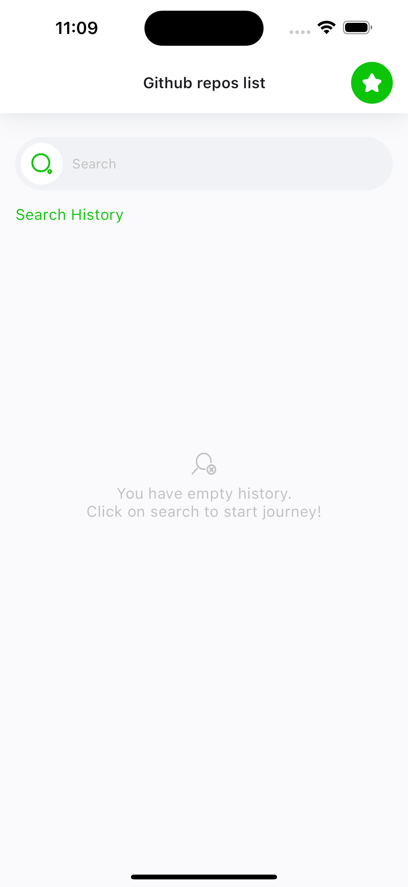
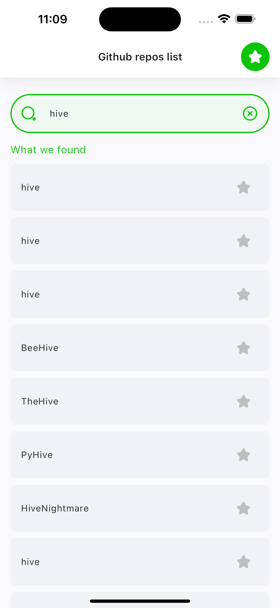
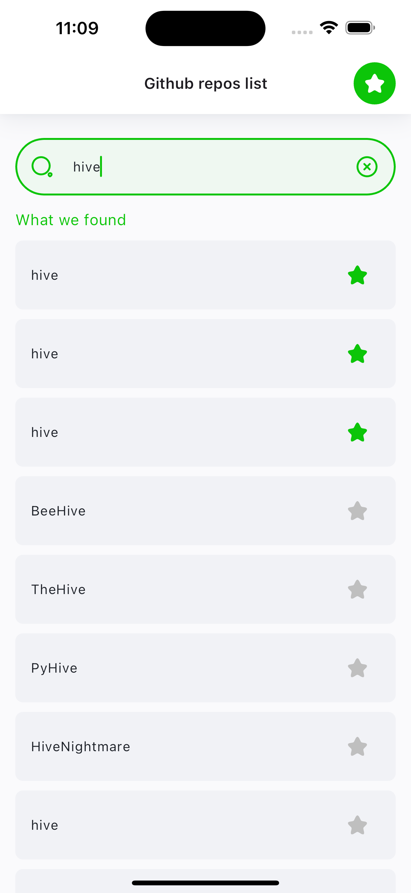

# Github Repos List

Flutter project for searching and adding favourite repositories from GitHub.
To use the application, you have to setup GitHub API Token via [flutter_dotenv](https://pub.dev/packages/flutter_dotenv).

# Screenshots of the application

